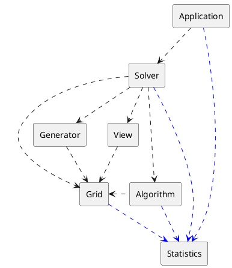

# Documentation of components

## Component dependency diagram

---
## Component Responsibility Collaboration Model

### 1. Grid
|Responsibility|Collaboration|
|:-|-:|
|Knows game's Width, Height and number of mines|Statistics (providing data)|
|Knows positions of mines||
|Knows numbers hidden under squares||
|Keeps track of the current state of the game||
|Gathers statistical data about itself||
|Limited interface for player-like interactions||
|Special interface for map generator||
---
### 2. Generator
|Responsibility|Collaboration|
|:-|-:|
|Generates a new game (a set of mines) according to some algorithm|Grid (generating games)|
|Puts the generated game into the Grid||
---
### 3. Algorithm
|Responsibility|Collaboration|
|:-|-:|
|Implements the logic of playing Minesweeper games|Grid (playing games)|
|Performs left and right clicks on the Grid|Statistics (providing data)|
|Gathers statistical data about itself|
---
### 4. View
|Responsibility|Collaboration|
|:-|-:|
|Knows how to display Grid and Statistics to the user|Grid (displaying)|
||Statistics (displaying)|
---
### 5. Solver
|Responsibility|Collaboration|
|:-|-:|
|Owns the Grid, Generator, Algorithm and View|Grid (ownership)|
|Coordinates generation of new games and playing them|Generator (initiating generation)|
|Gathers statistical data about itself|Algorithm (initiating execution)|
||View (initiating display)|
||Statistics (providing data)|
---
### 6. Statistics
|Responsibility|Collaboration|
|:-|-:|
|Gathers and stores desired statistical data from other components||
|Has an interface to enable/disable gathering of specific statistics||
---
### 7. Application
|Responsibility|Collaboration|
|:-|-:|
|Implements GUI|
|Displays the Grid and Statistics|
|Allows the user to enable/disable Statistics gathering|View (logic of displaying)|
|Allows the user to set the Solver to automatically click on the Grid|Solver (automatically playing the game)|
---
