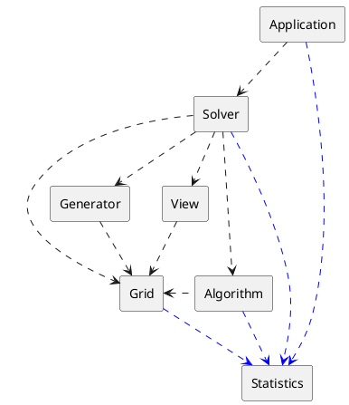

# Documentation of components

## Component dependency diagram

---
## Component Responsibility Collaboration Model

### 1. Grid
|Responsibility|
|:-|
|Knows game's Width, Height and number of mines|
|Knows positions of mines|
|Knows numbers hidden under squares|
|Keeps track of the current state of the game|
|Gathers statistical data about itself|
|Limited interface for player-like interactions|
|Special interface for map generator|

|Collaboration|
|:-|
|Statistics (providing data)|
---
### 2. Generator
|Responsibility|
|:-|
|Generates a new game (a set of mines) according to some algorithm|
|Puts the generated game into the Grid|

|Collaboration|
|:-|
|Grid (generating games)|
---
### 3. Algorithm
|Responsibility|
|:-|
|Implements the logic of playing Minesweeper games|
|Performs left and right clicks on the Grid|
|Gathers statistical data about itself|
---
|Collaboration|
|:-|
|Grid (playing games)|
|Statistics (providing data)|
---
### 4. View
|Responsibility|
|:-|
|Knows how to display Grid and Statistics to the user|
---
|Collaboration|
|:-|
|Grid (displaying)|
|Statistics (displaying)|
---
### 5. Solver
|Responsibility|
|:-|
|Owns the Grid, Generator, Algorithm and View|
|Coordinates generation of new games and playing them|
|Gathers statistical data about itself|
---
|Collaboration|
|:-|
|Grid (ownership)|
|Generator (initiating generation)|
|Algorithm (initiating execution)|
|View (initiating display)|
|Statistics (providing data)|
---
### 6. Statistics
|Responsibility|
|:-|
|Gathers and stores desired statistical data from other components|
|Has an interface to enable/disable gathering of specific statistics|

|Collaboration|
|:-|
|None|
---
### 7. Application
|Responsibility|
|:-|
|Implements GUI|
|Displays the Grid and Statistics|
|Allows the user to enable/disable Statistics gathering|
|Allows the user to set the Solver to automatically click on the Grid|

|Collaboration|
|:-|
|View (logic of displaying)|
Solver (automatically playing the game)
---