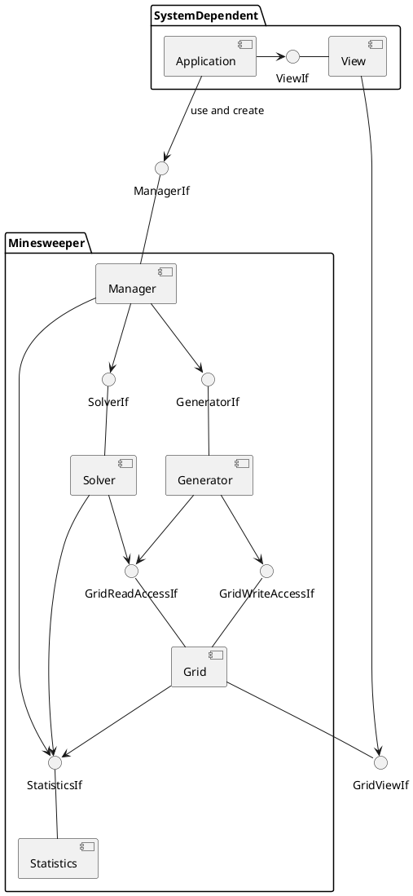

# Documentation of components

## Component dependency diagram

```plantuml
@startuml diagram_components

skinparam RectangleFontColor automatic

package SystemDependent {
    interface ViewIf
    component View
    component Application
}

interface ManagerIf
interface GridViewIf

package Minesweeper {
    component Manager
    component Generator
    component Grid
    component Solver
    component Statistics

    interface GeneratorIf
    interface GridWriteAccessIf
    interface GridReadAccessIf
    interface SolverIf
    interface StatisticsIf
}

Manager -up- ManagerIf
Application --> ManagerIf : use and create
Solver -up- SolverIf
Generator -up- GeneratorIf
Grid -up- GridWriteAccessIf
Grid -up- GridReadAccessIf
Generator --> GridWriteAccessIf
Generator --> GridReadAccessIf
Solver --> GridReadAccessIf

Manager --> GeneratorIf
Manager --> SolverIf
Statistics -up- StatisticsIf
Manager --> StatisticsIf
Solver --> StatisticsIf
Grid --> StatisticsIf

Grid -- GridViewIf
View --> GridViewIf
Application -right-> ViewIf
View -left- ViewIf

@enduml
```
