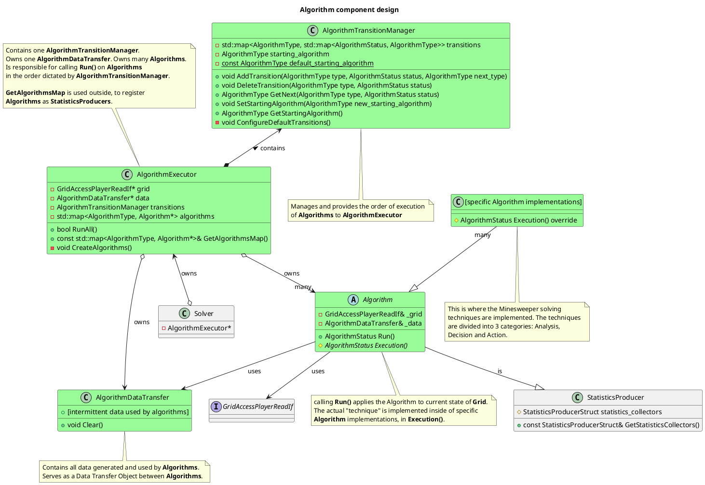
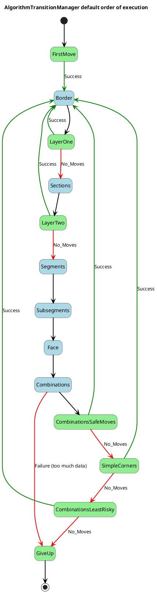

\page Detailed_Design_Algorithm Detailed Design: Algorithm

\tableofcontents

# Overview

Playing a game of Minesweeper requires the use of many different techniques. Those techniques are represented in code by various Algorithm classes. Those classes expose one public method, which is called to apply the technique to the current state of the Grid. This implementation allows the Algorithms to be arranged in different orders and configurations (strategies), to achieve different results.

# Terminology

**Technique** - A technique used to play a Minesweeper game, implemented in an Algorithm class. There are many techniques for different types of situations encountered in the game.

**Strategy** - An arrangement of techniques, defining their order and transitions between them. It defines how to play a game of Minesweeper from start to finish. Different strategies may be used to achieve different desired effects (win ratio, speed, efficiency, etc.).

# Algorithm types

Minesweeper techniques are divided into 3 functional groups.

## Analysis

Those are techniques, which <b>only observe the Grid</b>. The purpose of analysis Algorithms is to gather some specific information about the Grid. This information is then used by other Algorithms to make decisions. Some analysis Algorithms rely on other information provided by other analysis Algorithms, which forces a certain order of execution.

## Decision

Those are techniques, which <b>decide which fields should be left-clicked or right-clicked</b>. Those decisions are made based on information provided by analysis Algorithms, which must be executed beforehand. A given decision Algorithm is usually coupled with one or more analysis Algorithms, which provide the information necessary for making the decision.

## Action (TODO)

Those are techniques, which <b>perform clicks on the Grid</b>. Having the information about safe and unsafe fields from preceding decision Algorithms, the action Algorithm may choose which clicks to perform, and in what order. This is useful for imitating the way a human plays the game or for achieving desired efficiency of clicks.

# Algorithm component design

# Strategies

A **Strategy** may be thought of as a state machine of Algorithms, where each Algorithm is a state.

Different **Strategies** are implemented in AlgorithmTransitionManager by defining transitions between Algorithms. A **Transition** determines which Algorithm shall be executed next, based on which Algorithm was executed previously and what was its AlgorithmStatus. Each Algorithm may be used as a part of multiple **Strategies**. Within a single **Strategy**, each Algorithm may have multiple **Transitions** (maximum one per each possible **AlgorithmStatus** it may return).

**Analysis Algorithms** are coloured Blue.

**Decision Algorithms** are coloured Green.

**Action Algorithms** are coloured Gold.

## Max win ratio strategy (default)

This strategy maximizes win ratio. Second priority is fast execution time. Click efficiency and human similarity are not considered at all.

